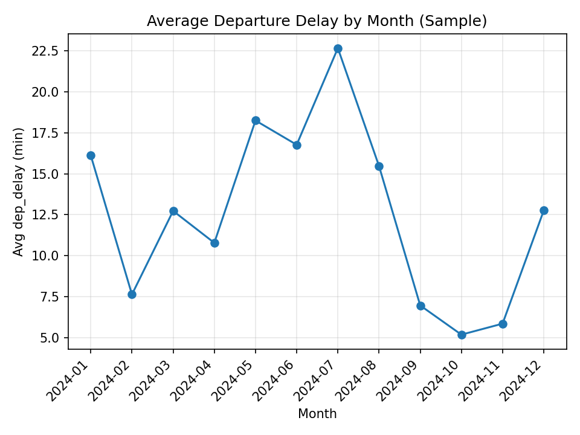
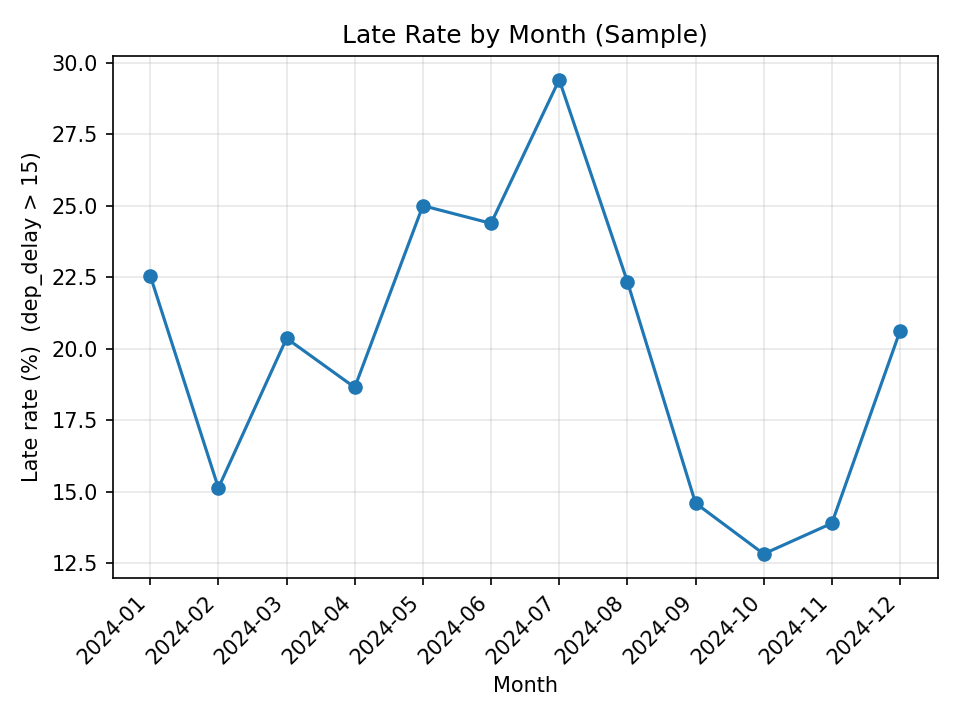

# Flight Delay Operations Intelligence

A reproducible aviation analytics case study that identifies operational delay patterns, route risk, carrier volatility, and actionable mitigation priorities using U.S. 2024 flight data.

## Why this project matters

Flight delays are not just passenger inconvenience metrics. They are operational signals tied to route fragility, carrier performance variability, airport congestion, and downstream disruption risk.

This project turns raw delay data into decision-oriented insights for operations, performance, and planning teams.

## Key questions

- Which months show the highest operational delay burden?
- Which origins and carriers underperform consistently?
- Which routes show elevated disruption risk?
- What proportion of delay burden comes from each delay reason?
- Which interventions would likely reduce late departures most effectively?

## Tools used

- Python
- pandas
- matplotlib
- PowerShell
- CSV-based reproducible pipeline

## Run locally

Run the full pipeline:

```powershell
powershell -ExecutionPolicy Bypass -File .\run.ps1
```

Fast mode:

```powershell
powershell -ExecutionPolicy Bypass -File .\run.ps1 -SkipSampleGen
```

## What the pipeline does

The pipeline will:

- Create `.venv` if missing
- Install `requirements.txt`
- Generate `data/sample_multi_month.csv` if the source dataset exists
- Run:
  - `analysis_eda.py`
  - `analysis_ops.py`
  - `main.py`
- Write outputs into the `outputs/` folder

## Preview

### Average delay by month


### Late rate by month


## Key outputs

### Report
- `REPORT.md` — executive summary and operational recommendations

### Tables
- `outputs/by_month_metrics.csv`
- `outputs/worst_origins.csv`
- `outputs/worst_carriers.csv`
- `outputs/top_risky_routes.csv`
- `outputs/delay_reason_share.csv`

### Charts
- `outputs/avg_delay_by_month.png`
- `outputs/late_rate_by_month.png`
- `outputs/dep_delay_hist.png`
- `outputs/avg_delay_by_dayofweek.png`

## Key findings

- Delay burden is not distributed evenly across the year.
- A limited number of origin airports account for a disproportionate share of operational underperformance.
- Some carriers show persistent delay volatility, suggesting structural operational pressure rather than isolated issues.
- A subset of routes repeatedly appears in the risk profile, indicating corridor-level fragility.
- Delay reason mix suggests that intervention priorities should vary by segment instead of using a single blanket solution.

## Operational recommendations

- Prioritize review of repeatedly underperforming origin stations.
- Flag high-risk routes for schedule buffer and turnaround review.
- Separate carrier-wide issues from airport-specific congestion before intervention.
- Track monthly delay burden as an early-warning operational metric.
- Monitor delay-reason share over time to distinguish tactical vs structural disruption drivers.

## Notes

If `data/sample_multi_month.csv` is missing and the large source dataset is not present under `ops-bigdata/`, the pipeline will fail with a clear error.

Recommended entry point for reviewers: `REPORT.md`.
